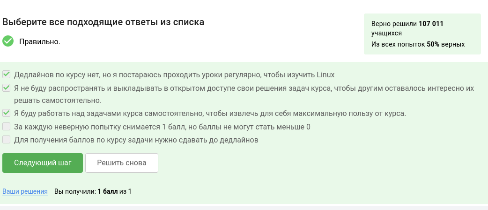
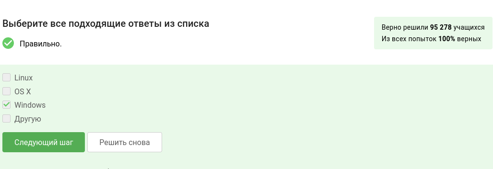
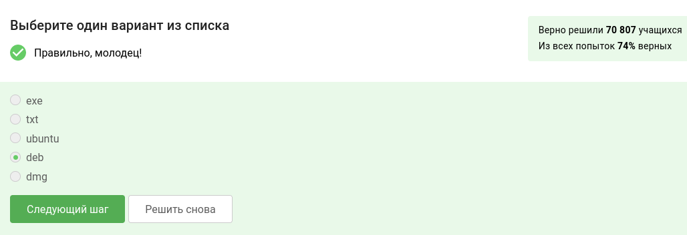
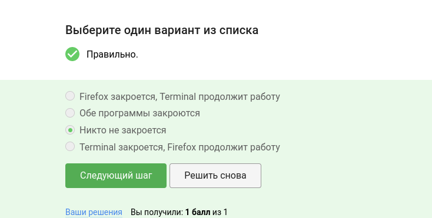
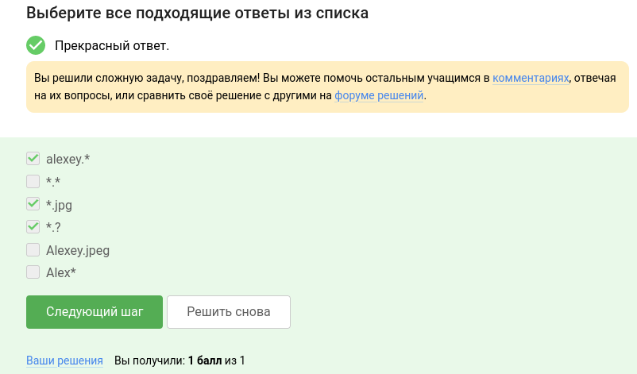

---
## Front matter
title: "Внешний курс по Linux - Раздел 1"
subtitle: "Отчёт по выполнению курса"
author: "Чистов Даниил Максимович"

## Generic otions
lang: ru-RU
toc-title: "Содержание"

## Bibliography
bibliography: bib/cite.bib
csl: pandoc/csl/gost-r-7-0-5-2008-numeric.csl

## Pdf output format
toc: true # Table of contents
toc-depth: 2
lof: true # List of figures
lot: false # List of tables
fontsize: 12pt
linestretch: 1.5
papersize: a4
documentclass: scrreprt
## I18n polyglossia
polyglossia-lang:
  name: russian
  options:
	- spelling=modern
	- babelshorthands=true
polyglossia-otherlangs:
  name: english
## I18n babel
babel-lang: russian
babel-otherlangs: english
## Fonts
mainfont: PT Serif
romanfont: PT Serif
sansfont: PT Sans
monofont: PT Mono
mainfontoptions: Ligatures=TeX
romanfontoptions: Ligatures=TeX
sansfontoptions: Ligatures=TeX,Scale=MatchLowercase
monofontoptions: Scale=MatchLowercase,Scale=0.9
## Biblatex
biblatex: true
biblio-style: "gost-numeric"
biblatexoptions:
  - parentracker=true
  - backend=biber
  - hyperref=auto
  - language=auto
  - autolang=other*
  - citestyle=gost-numeric
## Pandoc-crossref LaTeX customization
figureTitle: "Рис."
tableTitle: "Таблица"
listingTitle: "Листинг"
lofTitle: "Список иллюстраций"
lotTitle: "Список таблиц"
lolTitle: "Листинги"
## Misc options
indent: true
header-includes:
  - \usepackage{indentfirst}
  - \usepackage{float} # keep figures where there are in the text
  - \floatplacement{figure}{H} # keep figures where there are in the text
---

# Цель работы

Цель данной работы - пройти внешний курс по ОС Linux, чтобы проверить свои знания, а также узнать что-то новое. Выполнение требуется задокументировать.

# Выполнение лабораторной работы

Все скриншоты первого этапа: (рис. [-@fig:001]), (рис. [-@fig:002]), (рис. [-@fig:003]), (рис. [-@fig:004]), (рис. [-@fig:005]), (рис. [-@fig:006]), (рис. [-@fig:007]), (рис. [-@fig:008]), (рис. [-@fig:009]), (рис. [-@fig:010]), (рис. [-@fig:011]), (рис. [-@fig:012]), (рис. [-@fig:013]), (рис. [-@fig:014]), (рис. [-@fig:015]), (рис. [-@fig:016]), (рис. [-@fig:017]), (рис. [-@fig:018]), (рис. [-@fig:019]), (рис. [-@fig:020]), (рис. [-@fig:021]), (рис. [-@fig:022]), (рис. [-@fig:023]), (рис. [-@fig:024]), (рис. [-@fig:025]), (рис. [-@fig:026]), (рис. [-@fig:027]), (рис. [-@fig:028]), (рис. [-@fig:029]), (рис. [-@fig:030]), (рис. [-@fig:031]).

Первые несколько заданий для ознакомления с платформой.

Курс называется "Введение в Linux".

{#fig:001 width=70%}

Чтобы ответить на этот вопрос, нужно прочитать критерии прохождения курса.

{#fig:002 width=70%}

На моём компьютере установлена ОС Windows 11.

{#fig:003 width=70%}

Продолжаю выполнять задания, пока что моих знаний за время обучения в университете достаточно. Виртуальная машина это особая программа для эмуляции гостевых ОС.

{#fig:004 width=70%}

Моя виртуальная машина прекрасно работает.

{#fig:005 width=70%}

В этом задании не было ничего сложного. Я открыл libreOffice, написал "Hello, Linux!", сохранил в нужном формате (.xml).

{#fig:031 width=70%}

Всё верно!

{#fig:006 width=70%}

deb - от названия Debian, формат пакетов.

{#fig:007 width=70%}

Для этого задания пришлось установить VLC Mediaplayer, чуток подождать и считать первую фамилию - Denis-Courmont.

{#fig:008 width=70%}

{#fig:009 width=70%}

По слову update (с англ. обновление) можно догадаться, какие в этом задании правильные ответы.

{#fig:010 width=70%}

Широко известный сленг пользователей терминалом, называть его консолью, командной. Но не Ассолью или термином.

{#fig:011 width=70%}

При работе с консолью важно учитывать регитср. Поэтому только команда pwd сработает.

{#fig:012 width=70%}

В последнем пункте не указана директория, где следует выполнить команду. Поэтому этот вариант не подходит.

{#fig:013 width=70%}

По странной причине это задание (13), несмотря на мои усилия, долго невыполнялось. Некорректность ответов также выделили люди в комментариях.

{#fig:014 width=70%}

Консоль запустит браузер, но на этом процесс закончен. Она не будет находится в статусе ожидании команд для firefox, поэтому если написать exit - ничего не закроется.

{#fig:015 width=70%}

Так можно запусть программу в фоновом режиме (bg - background - фон)

{#fig:016 width=70%}

Для выполнения следующего задания потребовалось скачать файл и присвоить ему права для выполнения. Это можно сделать командой:

chmod +x (имя файла)

Я так и сделал, затем запустил файл и получил следующий вывод:

{#fig:017 width=70%}

Всё верно!

{#fig:018 width=70%}

Автоматически вывод появится на экране.

{#fig:019 width=70%}

Единственное перенаправление вывода произойдет при использовании команд 1 и 4.

{#fig:020 width=70%}

stderr это специальный поток ошибок, который никак не  перенаправить, как например stdout, такой поток всегда выводится на экран.

{#fig:021 width=70%}

Из-за ключа -O файл окажется в текущей папке, в которой мы находимся.

{#fig:022 width=70%}

От английского слова quiet (тихий), можно сделать предположение, что если нам не нужен вывод в консоли, то мы напишем -q. Всё верно!

{#fig:023 width=70%}

Сначала будут скачаны html файлы, из-за -r -l i, т.к это страничка в интернете, но из-за -A jpg мы говорим программе отдать только файлы jpg, поэтому только они останутся.

{#fig:024 width=70%}

Среди данных вариантов ответа выделено одно из отличий gzip и zip - удаление архива.

{#fig:025 width=70%}

Создать архив из директории с файлами можно с помощью zip и tar.

{#fig:026 width=70%}

Вспоминаем поиск файлов.

{#fig:027 width=70%}

Поиск по тексту ищет любую инстанцию слова world. Здесь дело в регистре, т.к слово "World" и "world" разные вещи.

{#fig:028 width=70%}

В этом задании требуется встретить все цитаты со словом "love" и отправить их в один файл. Для этого воспользуюсь следующей командой:

grep -r "love" (путь/к/файлам) > ans.text

Утилитой grep ищу рекурсивно (-r) каждую встречу со словом "love" по заданному пути, затем вывод от этой команды перевожу в файл ans.txt, как вы можете увидеть на скриншоте ниже команда успешно сработала.

{#fig:029 width=70%}

И после того, как я загружу этот файл. Мне говорят, что я правильно выполнил задание. Отлично! На этом всё с разделом 1.

{#fig:030 width=70%}

# Выводы

По окончанию выполнения раздела 1 внешнего курса по ОС Linux, я проверил свои знания, а также узнал что-то новое. Документация к выполнеию была оформлена. Поставленные цели были достигнуты.
