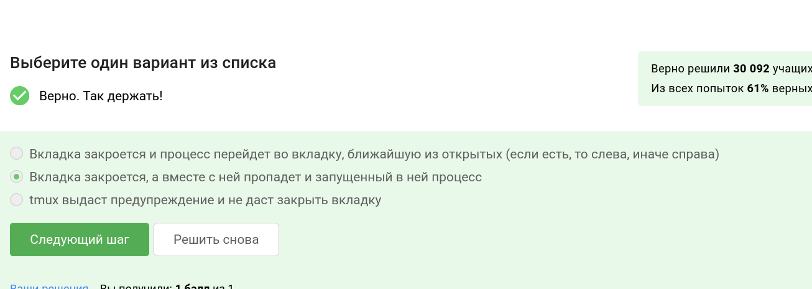

---
## Front matter
title: "Внешний курс по Linux - Раздел 2"
subtitle: "Отчёт по выполнению курса"
author: "Чистов Даниил Максимович"

## Generic otions
lang: ru-RU
toc-title: "Содержание"

## Bibliography
bibliography: bib/cite.bib
csl: pandoc/csl/gost-r-7-0-5-2008-numeric.csl

## Pdf output format
toc: true # Table of contents
toc-depth: 2
lof: true # List of figures
lot: false # List of tables
fontsize: 12pt
linestretch: 1.5
papersize: a4
documentclass: scrreprt
## I18n polyglossia
polyglossia-lang:
  name: russian
  options:
	- spelling=modern
	- babelshorthands=true
polyglossia-otherlangs:
  name: english
## I18n babel
babel-lang: russian
babel-otherlangs: english
## Fonts
mainfont: PT Serif
romanfont: PT Serif
sansfont: PT Sans
monofont: PT Mono
mainfontoptions: Ligatures=TeX
romanfontoptions: Ligatures=TeX
sansfontoptions: Ligatures=TeX,Scale=MatchLowercase
monofontoptions: Scale=MatchLowercase,Scale=0.9
## Biblatex
biblatex: true
biblio-style: "gost-numeric"
biblatexoptions:
  - parentracker=true
  - backend=biber
  - hyperref=auto
  - language=auto
  - autolang=other*
  - citestyle=gost-numeric
## Pandoc-crossref LaTeX customization
figureTitle: "Рис."
tableTitle: "Таблица"
listingTitle: "Листинг"
lofTitle: "Список иллюстраций"
lotTitle: "Список таблиц"
lolTitle: "Листинги"
## Misc options
indent: true
header-includes:
  - \usepackage{indentfirst}
  - \usepackage{float} # keep figures where there are in the text
  - \floatplacement{figure}{H} # keep figures where there are in the text
---

# Цель работы

Цель данной работы - пройти внешний курс по ОС Linux, чтобы проверить свои знания, а также узнать что-то новое. Выполнение требуется задокументировать.

# Выполнение внешнего курса

Все скриншоты первого этапа: (рис. [-@fig:001]), (рис. [-@fig:002]), (рис. [-@fig:003]), (рис. [-@fig:004]), (рис. [-@fig:005]), (рис. [-@fig:006]), (рис. [-@fig:007]), (рис. [-@fig:008]), (рис. [-@fig:009]), (рис. [-@fig:010]), (рис. [-@fig:011]), (рис. [-@fig:012]), (рис. [-@fig:013]), (рис. [-@fig:014]), (рис. [-@fig:015]), (рис. [-@fig:016]), (рис. [-@fig:017]), (рис. [-@fig:018]), (рис. [-@fig:019]), (рис. [-@fig:020]), (рис. [-@fig:021]), (рис. [-@fig:022]), (рис. [-@fig:023]), (рис. [-@fig:024]), (рис. [-@fig:025]), (рис. [-@fig:026]), (рис. [-@fig:027]), (рис. [-@fig:028]).

В этом вопросе верны все ответы, т.к. сервер - особая машина, в которой очень много ресурсов, благодаря этому она может выполнять все следующие задачи.

{#fig:001 width=70%}

Можно пересылать ключ id_rsa.pub, т.к он публичный.

{#fig:002 width=70%}

Здесь правильный ответ можно определить как минимум по наличию ключа -r, т.к. от нас требуется скопировать папку со всем её содержимым, для этого нужно вводить ключить -r - рекурсивно. А также команда для копирования с использованием серверов - scp.

{#fig:003 width=70%}

Здесь подойдёт только sudo apt-get update, т.к. проврека на наличие места не поможет нам узнать есть ли такой пакет для установки или нет, а осталные команды просто некорректны.

{#fig:004 width=70%}

filezilla умеет просматривать сервера, а также их файлы, вместе с этим эта программа умеет просматривать файлы на личном компьютере. Можно отсюда сделать вывод что можно копировать файлы с сервера на компьютер и обратно.

{#fig:005 width=70%}

Здесь подходят такие варианты ответа.

{#fig:006 width=70%}

По опыту известно, что есть утилита man, открывающая документацию, есть команда help, а также в некоторых программмах встроена команда help, которую можно активировать написав -h, -help, --help.

{#fig:007 width=70%}

После проверки и установки fastqc я прочитал, что используется формат данных fastq, bam_mapped, sam_mapped.

{#fig:008 width=70%}

У меня возникли проблемы с установкой clustalw, поэтому я воспользовался документацией в интернете и выяснил, что для выполнения задачи нужно написать ключ -align, для команды clustalw (имя файла).

{#fig:009 width=70%}

Т.к. ctrl+C - завершает процесс, а ctrl+Z - приостанавливает его, можно сделать вывод, что program1 закроется и не будет показыватся в выводе утилиты jobs. Program2 будет приостановлена, но не завершена, а с Program3 не было произведено никаких действий, поэтому она останется работать.

{#fig:010 width=70%}

Одинаковы только у ps и top.

{#fig:011 width=70%}

Здесь нужно выбрать команду kill -9, это принудительный способ завершения процесса или набора процессов.

{#fig:012 width=70%}

Т.к. процесс приостановлен, то и если для него написать команду kill без дополнительных ключей, то завершение процесса начнётся только тогда, когда он возобновит работу.

{#fig:013 width=70%}

Запущенная программа потребляет какое-то неопределённое кол-во ресурсов процессора, а остановленная на то так и называется, что не потребляет ресурсов, т.к. остановилась.

{#fig:014 width=70%}

В других вариантах ответа нам дают какое-то определённое число, что неизвестно, либо процесс не занимает памяти вообще, что невозможно. Логично сделать вывод, что приостановленная программа занимает столько памяти, сколько она занимала в момент остановки.

{#fig:015 width=70%}

Не знаю о таких командах threadkill, а CTRL+C используется для процессов, а не потоков процесса.

{#fig:016 width=70%}

В предыдущем видео было указано, что bowtie2 можно запустить в несколько потоков, там приводится пример следующей командой:

bowtie2 -p 4

Таким образом запускается bowtie2 в четыре потока

{#fig:017 width=70%}

Следующее задание посложнее. Выполняю его в несколько этапов.

Скачиваю нужные файлы. В консоль пишу следующую команду:

{#fig:018 width=70%}

Теперь возьму вывод ошибок от команды bowtie2 -x index -U reads... и отправлю его в файлы ans.text

{#fig:019 width=70%}

Прочитаю файл ans.txt, вывод похож на правду.

{#fig:020 width=70%}

Отправляю файл. Всё верно!

{#fig:021 width=70%}

Т.к. нет никаких процессов, запущенных в фоновом режиме, то нам нечего выводит в основной режим командой fg. Поэтому выбираем соответствуюший ответ.

{#fig:022 width=70%}

Т.к. когда запускается tmux в нём есть одна вкладка, то если мы и её закроем то сам tmux прекратит работу

{#fig:023 width=70%}

Сам сервер работу не прекратит, а т.к. мы на нём запустили tmux, то он спокойно продолжит работу, это просто мы потеряем соединение с сервером.

{#fig:024 width=70%}

Процесс никуда не переедет, т.к. отдельная вкладка как отдельный терминал, а мы эту вкладку закрываем, то тогда хоть процесс в фоновом режиме он тоже прекратит работу.

{#fig:025 width=70%}

CTRL+B и ,

{#fig:026 width=70%}

Я поработал с tmux, также можно будет увидеть в видео отчёте.

{#fig:027 width=70%}

По итогу выбрал такие варианты ответа, всё правильно!

{#fig:028 width=70%}

# Выводы

По окончанию выполнения раздела 2 внешнего курса по ОС Linux, я проверил свои знания, а также узнал что-то новое. Документация к выполнеию была оформлена. Поставленные цели были достигнуты.
