---
## Front matter
title: "Внешний курс по Linux - Раздел 3"
subtitle: "Отчёт по выполнению курса"
author: "Чистов Даниил Максимович"

## Generic otions
lang: ru-RU
toc-title: "Содержание"

## Bibliography
bibliography: bib/cite.bib
csl: pandoc/csl/gost-r-7-0-5-2008-numeric.csl

## Pdf output format
toc: true # Table of contents
toc-depth: 2
lof: true # List of figures
lot: false # List of tables
fontsize: 12pt
linestretch: 1.5
papersize: a4
documentclass: scrreprt
## I18n polyglossia
polyglossia-lang:
  name: russian
  options:
	- spelling=modern
	- babelshorthands=true
polyglossia-otherlangs:
  name: english
## I18n babel
babel-lang: russian
babel-otherlangs: english
## Fonts
mainfont: PT Serif
romanfont: PT Serif
sansfont: PT Sans
monofont: PT Mono
mainfontoptions: Ligatures=TeX
romanfontoptions: Ligatures=TeX
sansfontoptions: Ligatures=TeX,Scale=MatchLowercase
monofontoptions: Scale=MatchLowercase,Scale=0.9
## Biblatex
biblatex: true
biblio-style: "gost-numeric"
biblatexoptions:
  - parentracker=true
  - backend=biber
  - hyperref=auto
  - language=auto
  - autolang=other*
  - citestyle=gost-numeric
## Pandoc-crossref LaTeX customization
figureTitle: "Рис."
tableTitle: "Таблица"
listingTitle: "Листинг"
lofTitle: "Список иллюстраций"
lotTitle: "Список таблиц"
lolTitle: "Листинги"
## Misc options
indent: true
header-includes:
  - \usepackage{indentfirst}
  - \usepackage{float} # keep figures where there are in the text
  - \floatplacement{figure}{H} # keep figures where there are in the text
---

# Цель работы

Цель данной работы - пройти внешний курс по ОС Linux, чтобы проверить свои знания, а также узнать что-то новое. Выполнение требуется задокументировать.

# Выполнение внешнего курса

Все скриншоты первого этапа: (рис. [-@fig:001]), (рис. [-@fig:002]), (рис. [-@fig:003]), (рис. [-@fig:004]), (рис. [-@fig:005]), (рис. [-@fig:006]), (рис. [-@fig:007]), (рис. [-@fig:008]), (рис. [-@fig:009]), (рис. [-@fig:010]), (рис. [-@fig:011]), (рис. [-@fig:012]), (рис. [-@fig:013]), (рис. [-@fig:014]), (рис. [-@fig:015]), (рис. [-@fig:016]), (рис. [-@fig:017]), (рис. [-@fig:018]), (рис. [-@fig:019]), (рис. [-@fig:020]).

Стандартная процедура выхода из vim

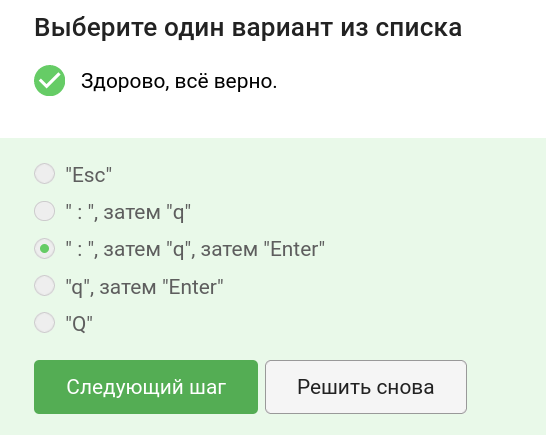{#fig:001 width=70%}

Чтобы выполнить данное задание пришлось лично перепроверить каждый вариант. Это можно увидеть на видео.

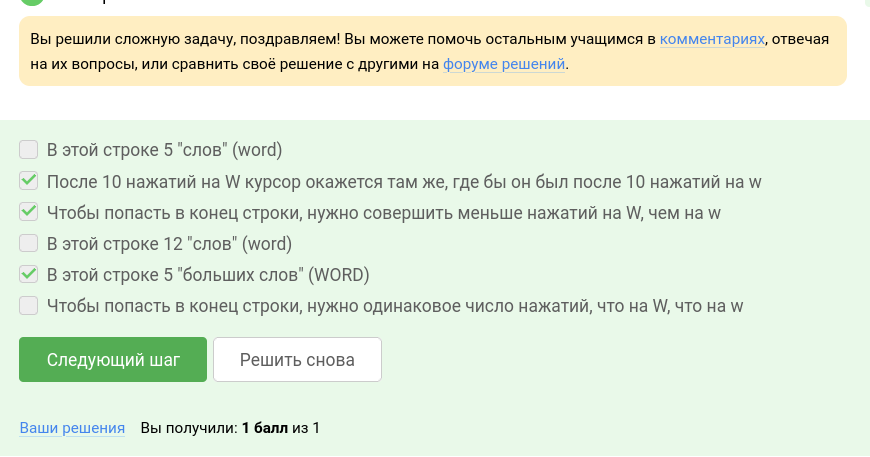{#fig:002 width=70%}

Аналогично с прошлым заданием, также пришлось открыть vi и проверить.

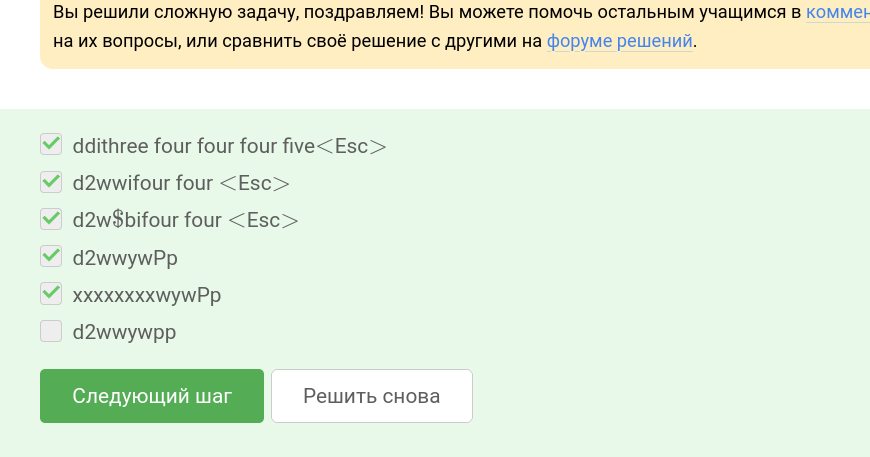{#fig:003 width=70%}

Существует определённая схема действий по поиску и замене.

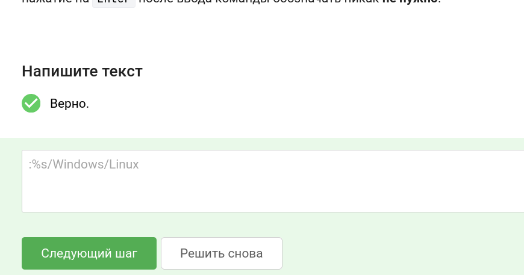{#fig:004 width=70%}

Лично пришлось проверить.

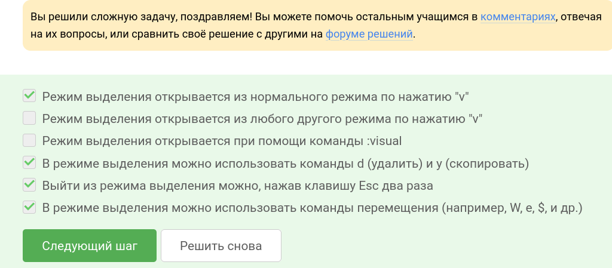{#fig:005 width=70%}

Только из набора C

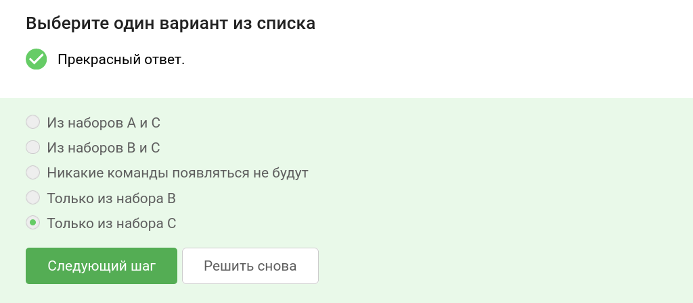{#fig:006 width=70%}

В этой директории мы создаём файл, поэтому выбираем такой ответ.

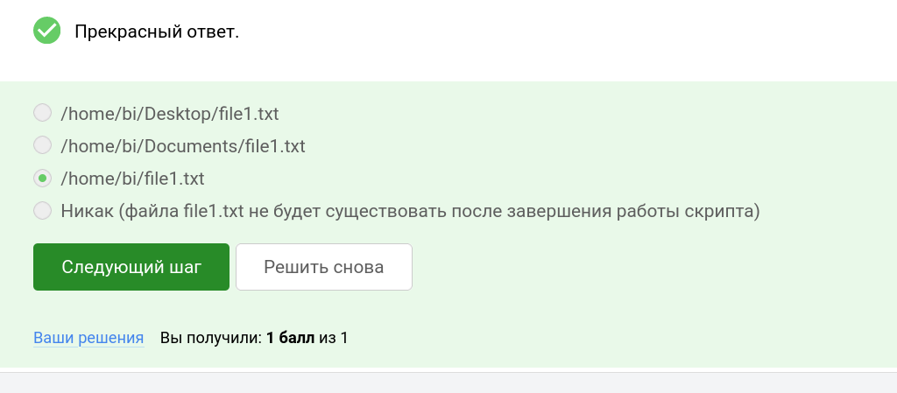{#fig:007 width=70%}

Пришлось признать, что догадался о других вариантах, зная, что _variable и variable правильные

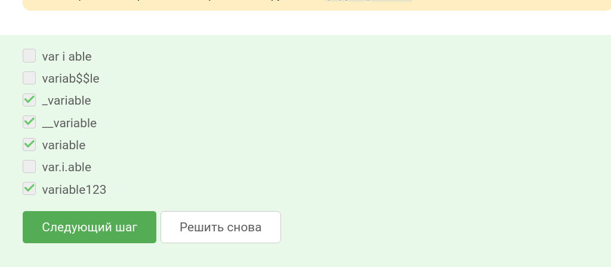{#fig:008 width=70%}

Простая программа, вспомнил второй семестр

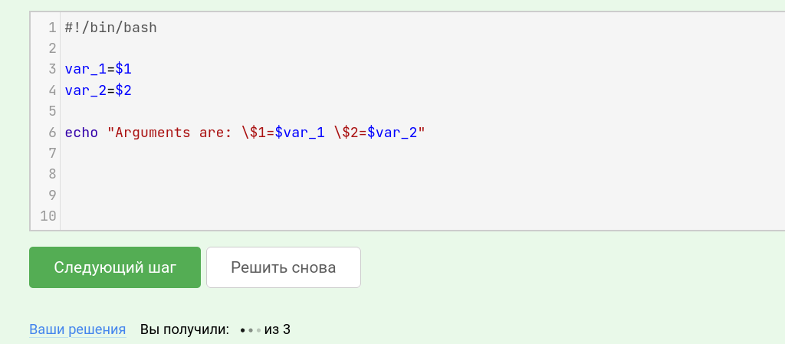{#fig:009 width=70%}

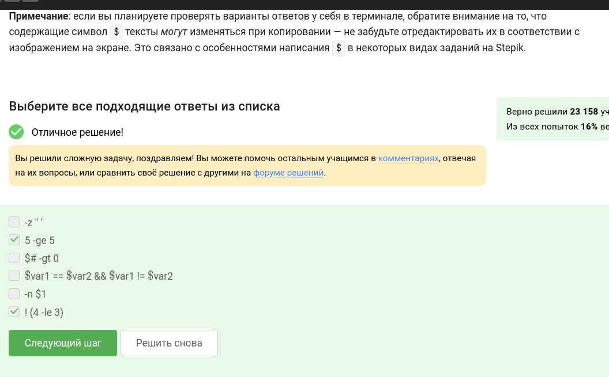{#fig:010 width=70%}

сначала four, потом four

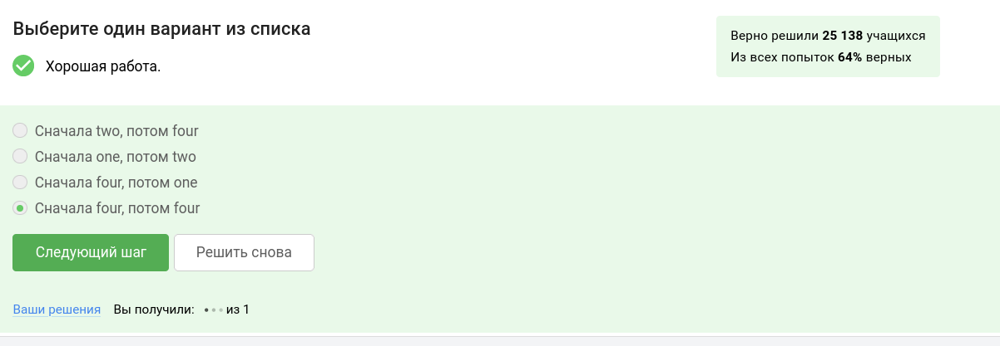{#fig:011 width=70%}

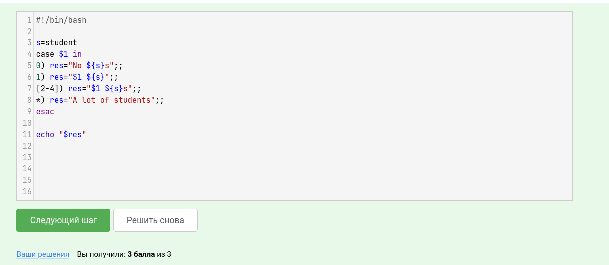{#fig:012 width=70%}

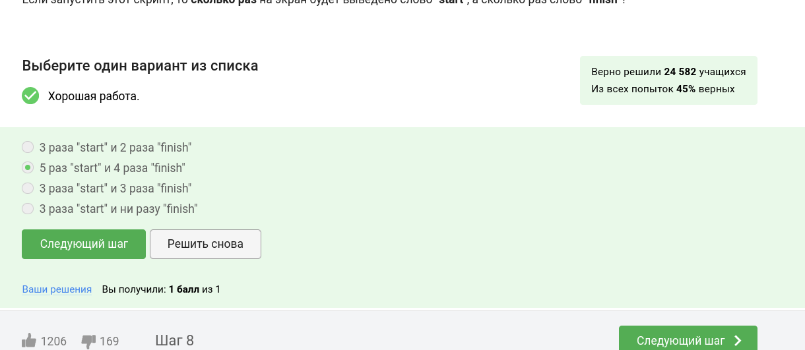{#fig:013 width=70%}

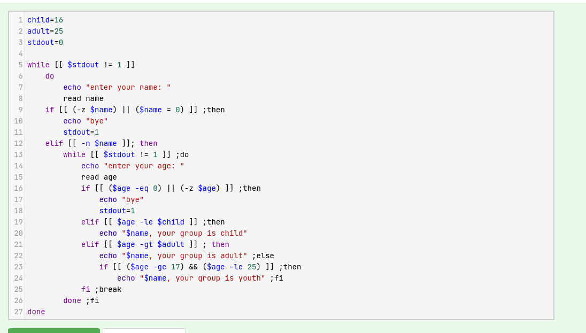{#fig:014 width=70%}

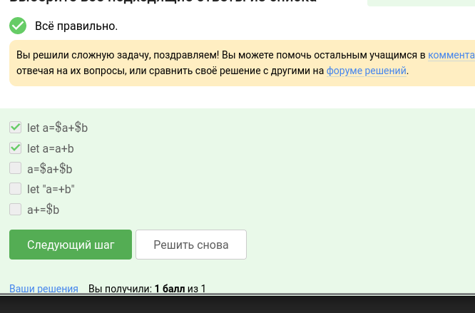{#fig:015 width=70%}

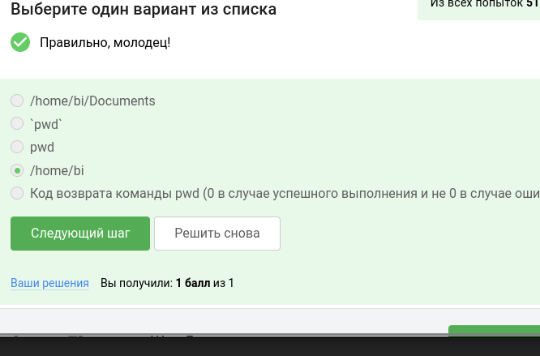{#fig:016 width=70%}

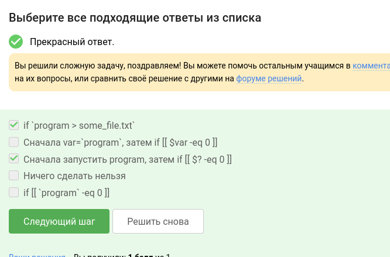{#fig:017 width=70%}

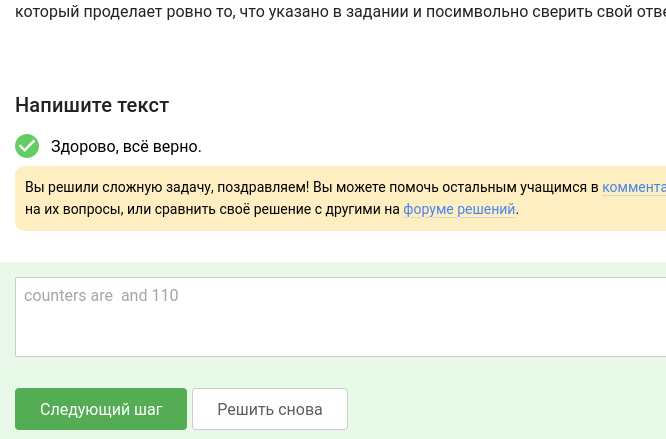{#fig:018 width=70%}

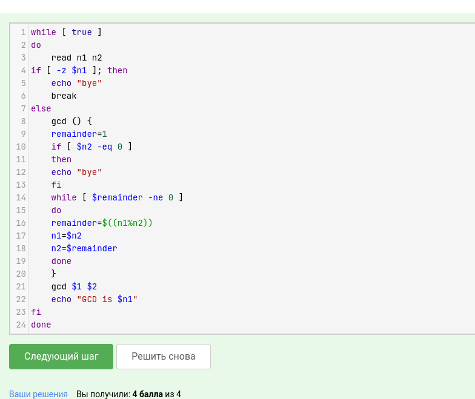{#fig:019 width=70%}

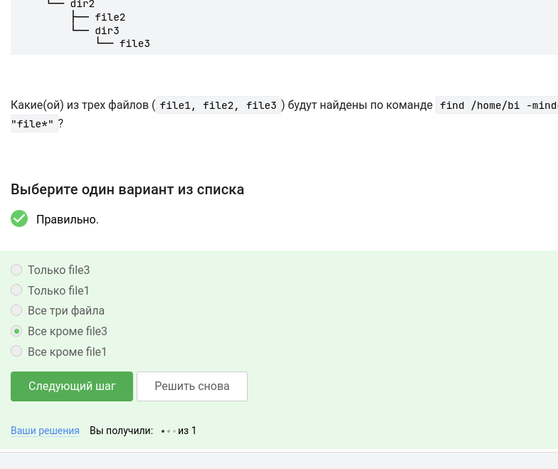{#fig:020 width=70%}

Мне хватило решить столько заданий, чтобы получить сертификат о прохождении

# Выводы

По окончанию выполнения раздела 2 внешнего курса по ОС Linux, я проверил свои знания, а также узнал что-то новое. Документация к выполнеию была оформлена. Поставленные цели были достигнуты.
